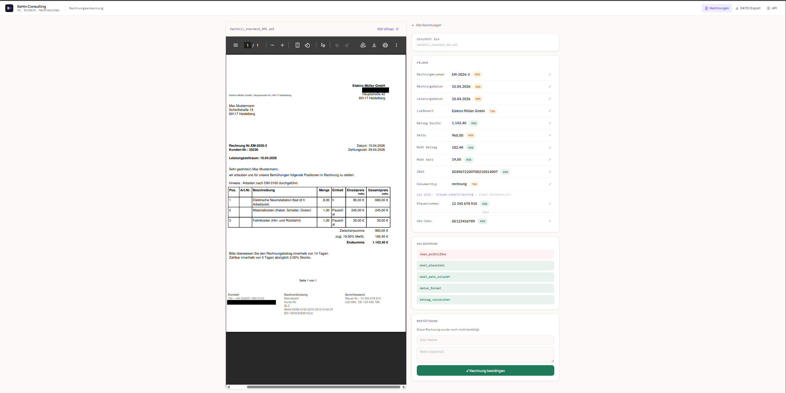
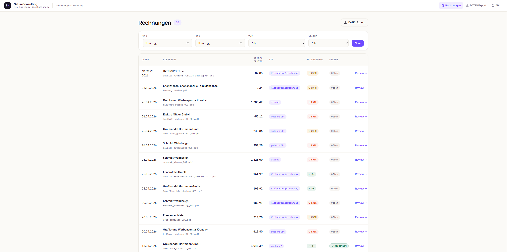
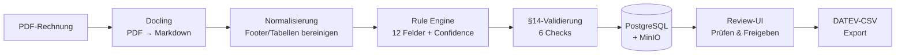

# Rechnungserkennung

**Selbst-gehostete, DSGVO-konforme Rechnungsextraktion — deterministisch, nachvollziehbar, ohne Cloud-KI.**

Ein Beleg-Extraktions-System, das aus PDF-Rechnungen die buchhaltungsrelevanten Felder zieht (§14 UStG), sie rechtlich validiert, einem Menschen zur Freigabe vorlegt und als **DATEV-CSV** exportiert. Läuft komplett on-premise auf PostgreSQL + MinIO — es verlässt kein Rechnungsdatum, kein Betrag und kein Kundenname jemals den eigenen Server.

<p align="center">
  
  
  
  
  
</p>

---

## Screenshots

> **Review-Oberfläche** — PDF links, extrahierte Felder mit Confidence-Ampel rechts, §14-Validierung und Freigabe darunter.



> **Rechnungsliste** — alle Belege mit Dokumenttyp, Betrag und Validierungs-Ampel (Fail/Warn), filterbar nach Zeitraum, Typ und Freigabestatus.



---

## Warum deterministisch — und nicht „einfach ein LLM drüberlaufen lassen"?

Bei Rechnungsdaten ist eine erfundene Zahl schlimmer als eine fehlende. Ein Sprachmodell, das eine IBAN oder einen Bruttobetrag „plausibel halluziniert", ist im Buchhaltungskontext ein Haftungsrisiko. Dieses System geht bewusst den anderen Weg:

| Prinzip | Umsetzung |
|---|---|
| **Keine Halluzination** | Jedes Feld kommt aus einer nachvollziehbaren Regel, nicht aus einem Wahrscheinlichkeitsmodell. |
| **Nachvollziehbarkeit** | Zu jedem Wert wird gespeichert, **welche Regel** ihn gefunden hat und mit welcher **Confidence**. |
| **DSGVO by design** | Kein API-Call, keine Cloud, keine Weitergabe. Echte Rechnungen bleiben auf dem eigenen Server. |
| **Mensch entscheidet** | Kein Wert wird gebucht, bevor ihn ein Mensch in der Review-UI bestätigt hat. |

Ein **optionaler LLM-Layer** (z. B. lokales Ollama-Modell für schwierige Freitext-Layouts) ist als spätere Erweiterung vorgesehen — als *Vorschlag* für die menschliche Prüfung, nicht als Autorität über den gebuchten Betrag. Siehe [Roadmap](#roadmap).

---

## Pipeline



1. **Ingestion** — PDF landet in MinIO, Docling wandelt es in strukturiertes Markdown.
2. **Extraktion** — die Rule Engine zieht 12 Felder heraus, jeweils mit Confidence-Score und der Regel, die angeschlagen hat.
3. **Validierung** — 6 §14-Checks (siehe unten) markieren `ok` / `warn` / `fail`.
4. **Review** — ein Mensch sieht PDF und Extraktion nebeneinander, korrigiert Felder und gibt frei.
5. **Export** — bestätigte Rechnungen gehen als DATEV-CSV in die Buchhaltung.

---

## Extrahierte Felder (§14 UStG)

`rechnungsnummer` · `datum` · `leistungsdatum` · `lieferant_name` · `betrag_brutto` · `netto_betrag` · `mwst_betrag` · `mwst_satz` · `iban` · `steuernummer` · `ust_idnr` · `dokumenttyp`

Der Feldkanon ist bewusst auf die **buchhaltungs- und vorsteuerrelevanten** Angaben beschränkt und mit einem Steuerberater abgestimmt (siehe [`docs/FELDANFORDERUNGEN_STEUERBERATER.md`](docs/FELDANFORDERUNGEN_STEUERBERATER.md)).

## Validierung — was geprüft wird

| Check | Bedeutung |
|---|---|
| **§14-Pflichtfelder** | Fehlt ein Pflichtfeld → `fail` (Vorsteuerabzug gefährdet). §33 UStDV: Kleinbetragsrechnungen (≤ 250 €) brauchen keine Rechnungsnummer. §14 Abs. 4 Nr. 3: Steuernummer *oder* USt-IdNr. genügt. |
| **IBAN-Prüfziffer** | Vollständige Prüfziffernrechnung nach ISO 13616 (mod-97). |
| **MwSt-Plausibilität** | `brutto ≈ netto + mwst` (Toleranz 0,05 €). |
| **MwSt-Satz** | Nur 0 %, 7 % oder 19 % gelten als üblich. |
| **Datum-Format** | Deutsches Format `TT.MM.JJJJ`, plausibles Jahr. |
| **Betrag-Vorzeichen** | Storno/Gutschrift muss in DATEV negativ gebucht werden. |

Die Cross-Field-Logik erkennt u. a. Kleinbetragsrechnungen automatisch am Bruttobetrag und übernimmt das Rechnungsdatum als Leistungsdatum, wenn die Rechnung das explizit angibt („Rechnungsdatum = Leistungsdatum").

---

## Tech-Stack

- **Extraktion:** [Docling](https://github.com/DS4SD/docling) (PDF → Markdown) + eigene, regelbasierte Extraktions-Engine (Python)
- **Persistenz:** PostgreSQL 16 (Extraktionen, Korrekturen, Freigaben) + MinIO (Original-PDFs, S3-kompatibel)
- **Review-UI:** FastAPI + Jinja2, PDF-Vorschau via presigned URLs
- **Export:** DATEV-CSV (Semikolon, UTF-8-BOM, Steuercode-Mapping)
- **Infrastruktur:** Docker Compose, alle Dienste an `127.0.0.1` gebunden

## Quick Start

Voraussetzungen: Docker + Docker Compose, Python 3.11+.

```bash
# 1. Konfiguration
cp .env.example .env          # Passwörter setzen

# 2. Infrastruktur (PostgreSQL + MinIO, Buckets werden automatisch angelegt)
docker compose up -d

# 3. Python-Umgebung
python3 -m venv .venv
.venv/bin/pip install -r requirements.txt   # Windows: .venv\Scripts\pip

# 4. Datenbankschema
psql "postgresql://invoice_ai@localhost:55432/invoice_ai" -f db/schema.sql

# 5. Rechnung einlesen (Ingestion → Extraktion → Validierung → DB)
python scripts/ingest_invoice.py pfad/zur/rechnung.pdf

# 6. Review-UI starten
uvicorn src.ui.app:app --reload
#    → http://127.0.0.1:8000/invoices
```

Lokale Endpunkte: PostgreSQL `127.0.0.1:55432`, MinIO-API `:9000`, MinIO-Console `:9001`, Review-UI `:8000`.

## Projektstruktur

```
src/
  extraction/     Rule Engine + Feld-Definitionen (Feldkanon eingefroren)
  validation.py   §14-UStG-Checks
  export/datev.py DATEV-CSV-Export
  ui/             FastAPI Review-Oberfläche (Liste, Detail, Freigabe)
  db.py storage.py review.py   PostgreSQL / MinIO / Freigabe-Logik
scripts/          Ingestion, Docling-Batch, Normalisierung, Analyse
db/schema.sql     PostgreSQL-Schema (Views für effektive Extraktion)
docs/             Leitfaden, Feldanforderungen, Wochenberichte
```

## Roadmap

- **Optionaler LLM-Layer** — lokales Modell (Ollama) als Vorschlagsgeber für schwierige Layouts; ändert nie einen Wert ohne menschliche Freigabe.
- **OCR für Scans** — Tesseract-Vorstufe für nicht-durchsuchbare PDFs.
- **Backup-Routine** und Mandantenfähigkeit für den Pilotbetrieb.

## Datenschutz & Sicherheit

- **Keine echten Rechnungen im Repo** — `samples/` und `output/` sind git-ignoriert.
- **Keine Secrets im Repo** — Zugangsdaten leben ausschließlich in der git-ignorierten `.env` (Vorlage: `.env.example`).
- **Keine Cloud-KI für echte Rechnungsdaten** — der gesamte Verarbeitungsweg bleibt lokal.

---

<sub>Eigenständiges Lernprojekt im Rahmen der Weiterbildung zum Staatlich anerkannten Wirtschaftsinformatiker — realer Consulting-Use-Case „Prozessautomatisierung / Dokumentenextraktion". Fachliche Grundlage: [`docs/FELDANFORDERUNGEN_STEUERBERATER.md`](docs/FELDANFORDERUNGEN_STEUERBERATER.md).</sub>
